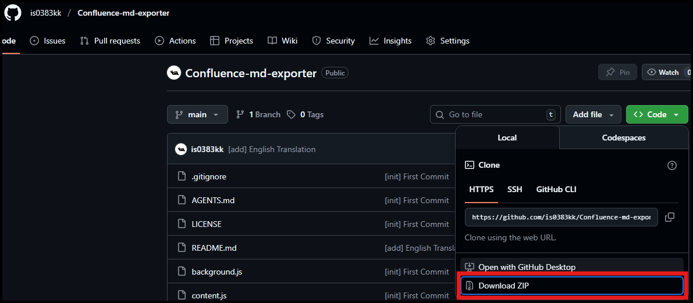
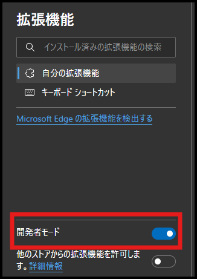
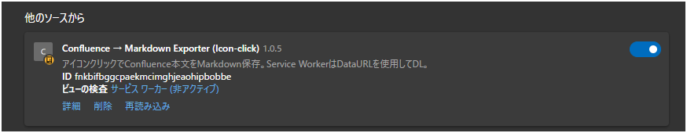
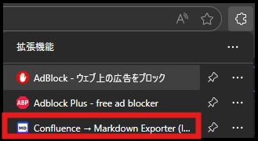

# Confluence → Markdown Exporter

A Chrome/Microsoft Edge extension that allows you to export Confluence page content to Markdown format with just one click.

## Features

- Download the current page as a Markdown file with a single click on the toolbar icon
- Automatic file naming using Confluence page title and page ID
- Convert HTML elements to Markdown syntax (headings, lists, code blocks, images, etc.)
- Compatible with Chrome Manifest V3

## Installation

1. Clone or download this repository



2. Open `chrome://extensions` for Chrome or `edge://extensions/` for Edge
3. Enable "Developer mode"



4. Click "Load unpacked extension"


5. Select the downloaded folder (confluence-md-exporter)

Check that the following is displayed:  


## Usage

1. Open a Confluence page
2. Click the extension icon in the browser toolbar



3. The Markdown file will be automatically downloaded

## File Structure

```
confluence-md-exporter/
├── manifest.json      # Chrome extension configuration file
├── background.js      # Service worker (main processing)
├── content.js         # Content script (executes on page)
├── turndown.js        # HTML→Markdown conversion library
├── icon.png          # Extension icon
└── README.md         # This file
```

## Development

### Reload

After making code changes:

1. Click the "Reload" button for the extension in `chrome://extensions`
2. Click the icon on any page to verify functionality

### Testing

Currently validated through manual testing:

- Click the icon on Confluence pages and verify `.md` file is downloaded
- Verify filename is page title + page ID (if exists)
- Verify headings, lists, code blocks, and images are properly converted
- Check `[Exporter]` logs and errors in DevTools console

## Technical Specifications

- **Manifest Version**: 3
- **Language**: JavaScript (ES2020+)
- **Required Permissions**:
  - `scripting`: Content script injection
  - `downloads`: File downloads
  - `activeTab`: Access to active tab
- **Supported URLs**: All HTTP/HTTPS sites (`*://*/*`)

## License

MIT License

---

# Confluence → Markdown Exporter

Confluence ページの本文をワンクリックで Markdown 形式にエクスポートできる Chrome／Microsoft Edge 拡張機能です。

## 機能

- ツールバーアイコンをクリックするだけで、現在のページを Markdown ファイルとしてダウンロード
- Confluence ページのタイトルとページ ID を使用した自動ファイル命名
- HTML 要素を Markdown 記法に変換（見出し、リスト、コードブロック、画像など）
- Chrome Manifest V3 対応

## インストール

1. このリポジトリをクローンまたはダウンロード


2. Chrome の場合は `chrome://extensions` を開く／Edge の場合は`edge://extensions/`を開く
3. 「デベロッパーモード（開発者モード）」を有効にする


4. 「パッケージ化されていない拡張機能を読み込む／展開して読み込み」をクリック


5. ダウンロードしたフォルダ（confluence-md-exporter）を選択し、下記のように表示されることを確認する


## 使用方法

1. Confluence ページを開く
2. ブラウザのツールバーにある拡張機能アイコンをクリック


3. Markdown ファイルが自動的にダウンロードされます

## ファイル構成

```
confluence-md-exporter/
├── manifest.json      # Chrome拡張の設定ファイル
├── background.js      # サービスワーカー（メイン処理）
├── content.js         # コンテンツスクリプト（ページ内実行）
├── turndown.js        # HTML→Markdown変換ライブラリ
├── icon.png          # 拡張機能アイコン
└── README.md         # このファイル
```

## 開発

### リロード

コードを変更した後：

1. `chrome://extensions` で拡張機能の「リロード」ボタンをクリック
2. 任意のページでアイコンをクリックして動作確認

### テスト

現在は手動テストで検証：

- Confluence ページでアイコンをクリックし、`.md`ファイルがダウンロードされること
- ファイル名がページタイトル+ページ ID（存在する場合）になること
- 見出し、リスト、コードブロック、画像が適切に変換されること
- DevTools コンソールで`[Exporter]`のログ・エラーを確認

## 技術仕様

- **Manifest Version**: 3
- **言語**: JavaScript (ES2020+)
- **必要な権限**:
  - `scripting`: コンテンツスクリプトの注入
  - `downloads`: ファイルダウンロード
  - `activeTab`: アクティブタブへのアクセス
- **対応 URL**: すべての HTTP/HTTPS サイト（`*://*/*`）

## ライセンス

MIT License
